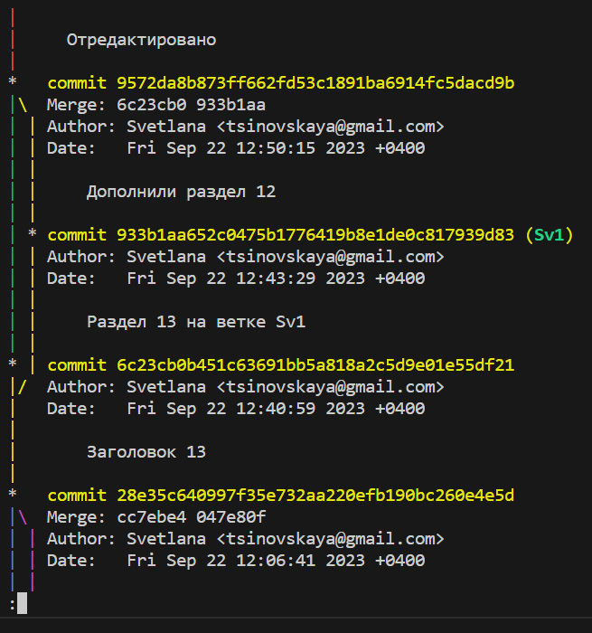
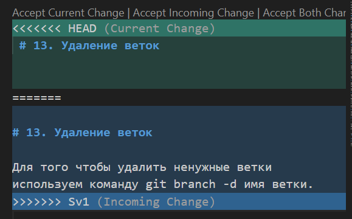

# Раздел 1. Работа с локальным репозиторием

## 1. Проверка установленного git

В терминале выполняем команду *git version*.
Если git установлен, то появится информация о версии git.
Иначе будет сообщение об ошибке.

## 2. Установка git

Загружаем последнюю версию с сайта https://git-scm.com/

## 3. Настройка git

При первом использовании git надо представиться, для этого надо ввести 2 команды:

*git config --global.user.name*

*git config --global.user.email*

Для того, чтобы проверить, прошла ли регистрация, надо ввести команду: 

*git config --list*

## 4. Инициализация репозитория

Записываем в терминал команду *git init*. 
В исходной папке появится скрытая папка .git

## 5. Добавление файла для отслеживания в git

Записываем в терминал команду *git add*, далее пробел и название файла. Можно использовать Tab: записать две первые буквы в названии файла и затем нажать Tab.

## 6. Сохрание версии файла

После внесения изменений в файл необходимо зафиксировать текущую версию файла. Для этого используем 2 команды: сначала *git add*, затем *git commit -m "..."*. В кавычках обязательно записывается комментарий о последних изменениях файла.

Можно использовать комбинированную команду: *git commit -am "..."*, которая включает в себя *git add* и *git commit*. 

## 7. Проверка состояния файла

Для этого используется команда *git status*. В случае, если есть изменения, которые не зафикированы, появится сообщение: __changes not staged to commit__. Если все изменения зафикированы в текущей версии, то появится сообщение: __nothing to commit.__

Вторая команда, которая используется для проверки состояния файла - *git diff*. Она показывает все изменения, которые были внесены в файл после последнего сохранения версии (коммита).

## 8. Контроль версий

Для того чтобы увидеть предыдущие версии файла, необходимо использовать команду *git log*. 

Чтобы увидеть краткий список версий, можно использовать *git log --oneline*. 

Для того чтобы переключиться на нужную версию, используем команду *git checkout <первые четыре цифры имени коммита>*.

Для того чтобы вернуться в последнюю версию, даем команду *git checkout master*. 

## 9. Добавление картинок и игнорирование файлов

Для того чтобы разместить картинку в нашем файле, надо добавить ее в папку. И после этого в нужном месте пишем следующее: .

Например: 

Для того чтобы удалить файлы с изображениями из отслеживания, надо создать файл __.gitignore__ .
В этом файле нужно записать расширения файлов, которые мы хотим игнорировать, используя звездочку.

Например: 
 
*.png 
 
*.jpg 

## 10. Ветвление

Для создания новой ветки наlо ввести в терминале команду *git branch <имя ветки>*. 

Ветвление необходимо для работы с файлами в отдельной ветке, сохраняя при этом исходное состояние файла до их слияния. Чтобы отобразить созданные ветки, используется команда *git branch*.

Чтобы перейти на другую ветку используем команду *git checkout <имя ветки>*. 

Для того чтобы увидеть графическое предствление веток и сохранений используем команду *git log --graph*.

Графическое изображение будет выглядеть вот так: 

## 11. Слияние веток

Для слияния веток и внесения изменений в наш основной файл используется команда *git merge <имя ветки>*. Слияние делается в ту ветку, в которой мы находимся сейчас. 

## 12. Конфликты 

Конфликты возникают при слиянии двух веток в одну, при этом одна и та же строка файла записана по-разному в разных версиях. 

Конфликт выглядит вот так: 

Для того чтобы разрешить конфликт выбираем опцию из меню, которое расположено вверху: принять текущую версию/принять входящую версию/принять обе версии. Далее можно отредактировать текст вручную. 

## 13. Удаление веток

Для того чтобы удалить ненужные ветки используем команду *git branch -d <имя ветки>*. 

# Раздел 2. Работа с удаленными репозиториями

## 1. Создание удаленного репозитория

Необходимо зайти на сайт https://github.com, создать аккаунт. 
Далее нажимая на + в правой верхней части страницы, можно создать новый удаленный репозиторий. Назовем его "Мой репозиторий". 

## 2. Загрузка информации из локального репозитория в удаленный репозиторий

После создания нового удаленного репозитория мы видим меню. 

Выбираем второй пункт: *push an existing repository from the command line*. 

Переходим в VScode, открываем нужную папку.

Последовательно копируем команды из этого пункта меню и вводим в терминале VScode. 

* *git remote add origin <ссылка на "Мой репозиторий">*

Эта команда связывает локальный репозиторий с удаленным. 

* *git branch -M main*

Эта команда назначает основную ветку нашего репозитория.

* *git push -u origin main*

Эта команда отправляет все последние изменения в локальном репозитории  в удаленный "Мой репозиторий". 

В дальнейшем при необходимости отправить в удаленный репозиторий обновления, просто используем команду *git push*.

## 3. Загрузка информации из удаленного репозитория "Мой репозиторий" в локальный репозиторий

Если файл изменялся в удаленном репозитории "Мой репозиторий", то можно "подтянуть" последние изменения в локальный репозиторий. Для этого используем команду *git pull*. 

## 4. Загрузка информации из удаленного репозитория "Сторонний репозиторий" в локальный репозиторий

Можно загрузить информацию из открытого репозитория другого владельца. Назовем его "Сторонний репозиторий". 

Для этого открываем "Сторонний репозиторий" в GitHub.
Нажимаем кнопку *__Code__*, выбираем вкладку *https*, копируем ссылку.

Возвращаемся в VScode, открываем нужный репозиторий или создаем новый *(см. Раздел 1, п. 4)*.

Вводим команду *git clone <ссылка на "Сторонний репозиторий">*. 

## 5. Загрузка информации из "Стороннего репозитория" в Мой аккаунт на GitHub

Можно создать копию "Стороннего репозитория" у себя в аккаунте. Для этого заходим в "Сторонний репозиторий" и нажимаем кнопку *__Fork__*.

Чтобы подгрузить обновления "Стороннего репозитория", используем кнопку *__Sync Fork__*. 

После этого можно скопировать этот репозиторий к себе в локальный репозиторий *(см. Раздел 2, п. 3)*. 

При работе с чужим репозиторием __всегда создаем новую ветку и работаем только в ней!__ 

## 6. Загрузка информации из своего репозитория в "Сторонний репозиторий"

1. Загружаем информацию из локального репозитория в "Мой репозиторий" на GitHub *(см. Раздел 2, п. 2)*. 

2. Предлагаем владельцу "Стороннего репозитория" "перетянуть" к себе изменения или дополнения, которые мы сделали. 

Для этого используем кнопки *__Compare and pull request__*, *__Pull request__*. 

Владелец "Стороннего репозитория" увидит наше предложение и может принять его, если захочет. 
